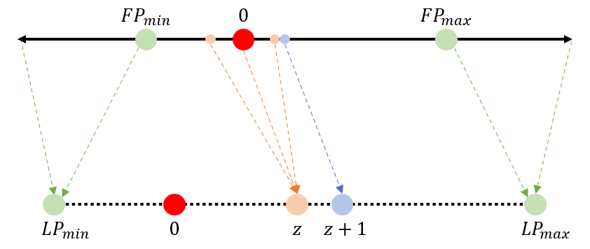
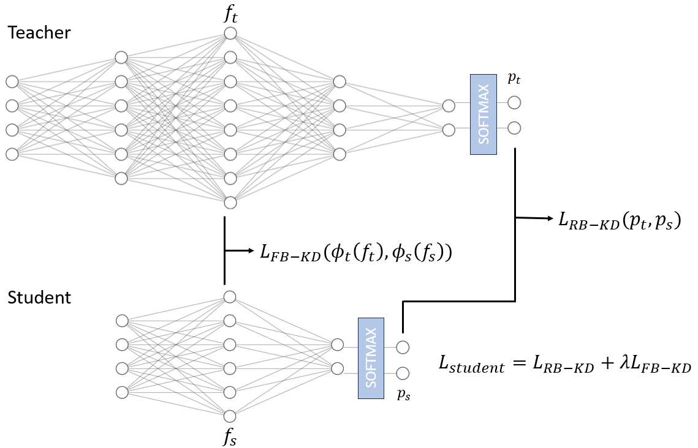
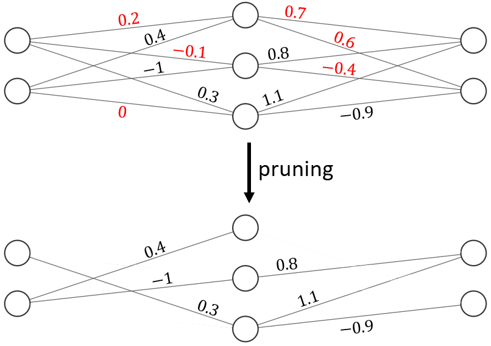

# Unriddling Compression-Induced Biases in Biometrics Applications: A Survey
Official repository for the paper "Unriddling Compression-Induced Biases in Biometrics Applications: A Survey".

## Abstract
The development of deep learning algorithms has extensively empowered humanity's task automatization capacity. However, the huge improvement in the performance of these models is highly correlated with their increasing level of complexity, limiting their usefulness in human-oriented applications, which are usually deployed in resource-constrained devices. This led to the development of compression techniques that drastically reduce the computational and memory costs of deep learning models without significant performance degradation. Nonetheless, the analysis of the consequences of compression is generally superficial, as emphasis is usually only given to its impact on global performance. In particular, the study of compression's influence on model bias has been widely neglected by the DL community. This paper aims to overcome this gap by presenting a comprehensive survey of current model compression techniques and their impact on model bias in biometrics applications. Apart from a literature systematization on quantization, knowledge distillation and pruning, we conduct a critical analysis of their comparative value while highlighting the need to direct compression research towards model fairness in future works.

## Quantization:
 

* Biometrics
    - Sub-byte quantization of mobile face recognition convolutional neural network
    - [Lightweight periocular recognition through low-bit quantization](https://github.com/jankolf/ijcb-periocular-quantization)
    - [Quantface: Towards lightweight face recognition by synthetic data low-bit quantization](https://github.com/fdbtrs/QuantFace)

* Computer Vision
    - [Incremental network quantization: Towards lossless cnns with lowprecision weights](https://github.com/AojunZhou/Incremental-Network-Quantization)
    - Quantization and training of neural networks for efficient integer arithmetic-only inference
    - [Lqnets: Learned quantization for highly accurate and compact deep neural networks](https://github.com/Microsoft/LQ-Nets)
    - Mr.biq: Post-training non-uniform quantization based on minimizing the reconstruction error
    - [Learnable lookup table for neural network quantization](https://github.com/The-Learning-And-Vision-Atelier-LAVA/LLT)
    - A neural network compression method based on knowledge-distillation and parameter quantization for the bearing fault diagnosis

## Knowledge Distillation
 

* Biometrics
    - Face model compression by distilling knowledge from neurons
    - Low-resolution face recognition in the wild via selective knowledge distillation
    - Shrinkteanet: Million-scale lightweight face recognition via shrinking teacher student networks
    - Compact models for periocular verification through knowledge distillation
    - Learning an evolutionary embedding via massive knowledge distillation
    - Efficient low-resolution face recognition via bridge distillation
    - Teacher guided neural architecture search for face recognition
    - [Mask-invariant face recognition through template-level knowledge distillation](https://github.com/fdbtrs/Masked-Face-Recognition-KD)
    - [Pocketnet: Extreme lightweight face recognition network using neural architecture search and multistep knowledge distillation](https://github.com/fdbtrs/PocketNet)
    - [Evaluation-oriented knowledge distillation for deep face recognition](https://github.com/Tencent/TFace/tree/master/recognition/tasks/ekd)
    - Template-driven knowledge distillation for compact and accurate periocular biometrics deep-learning models
    - Coupleface: Relation matters for face recognition distillation
    - Low-resolution iris recognition via knowledge transfer
    - Rethinking feature-based knowledge distillation for face recognition
    - Grouped knowledge distillation for deep face recognition
    - Probabilistic knowledge distillation of face ensembles
    - Privileged knowledge distillation for dimensional emotion recognition in the wild
    - [Unveiling the two-faced truth: Disentangling morphed identities for face morphing detection](https://github.com/NetoPedro/IDistill)

## Pruning
 

* Biometrics
    - Channel-level acceleration of deep face representations
    - Graph-based dynamic ensemble pruning for facial expression recognition
    - [Discrimination-aware network pruning for deep model compression](https://github.com/SCUT-AILab/DCP)
    - [Fairgrape: Fairnessaware gradient pruning method for face attribute classification](https://github.com/Bernardo1998/FairGRAPE)
    - Squeezerfacenet: Reducing a small face recognition cnn even more via filter pruning
    - Ipad: Iterative pruning with activation deviation for sclera biometrics

* Computer Vision
    - Pruning filters for efficient convnets
    - To prune, or not to prune: exploring the efficacy of pruning for model compression
    - The lottery ticket hypothesis: Finding sparse, trainable neural networks
    - Nisp: Pruning networks using neuron importance score propagation
    - [Snip: Single-shot network pruning based on connection sensitivity](https://github.com/namhoonlee/snip-public)
 
## Citation
If you use our code or data in your research, please cite with:
